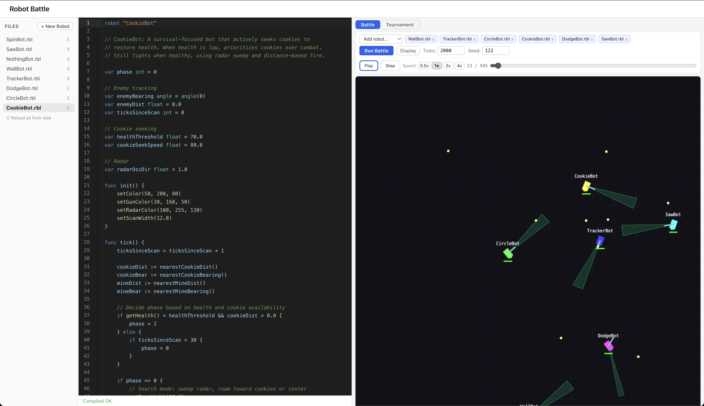

# Robot Battle

A browser-based robot battle game. Write robots in RBL (a Go-inspired language), compile them to WASM, and watch them fight in a 2D arena.

## Prerequisites

- [Bun](https://bun.sh/) (package manager and runtime)
- [pre-commit](https://pre-commit.com/) (git hooks)

Install both via Homebrew:

```sh
brew install oven-sh/bun/bun pre-commit
```

## Setup

```sh
# Install dependencies
bun install

# Install git hooks
pre-commit install
```

## Development

```sh
# Start the dev server (opens at http://localhost:5173)
bun run dev

# Run all tests
bun run test

# Run tests in watch mode
bun run test:watch

# Type-check
bun run typecheck

# Lint and format check
bun run check

# Auto-fix lint and formatting
bun run check:fix

# Format only
bun run format

# Production build
bun run build

# Preview production build
bun run preview
```

## Project Structure

```
spec/               Interface types (the contracts between modules)
  compiler.ts       Compiler input/output types
  simulation.ts     GameState, GameConfig, RobotModule, RobotAPI, events
  renderer.ts       BattleRenderer, GameLoop, TickSource
  ui.ts             Storage, RobotFile, tournament types
  INTERFACES.md     Design intent and invariants

src/
  compiler/         RBL source code → tokens → AST → WASM
    token.ts        Token types and keyword map
    lexer.ts        Hand-written lexer
  simulation/       Deterministic tick-based battle engine
    battle.ts       createBattle(), tick pipeline, movement physics
    prng.ts         xoshiro128** deterministic PRNG
    defaults.ts     Default game configuration
    test-stubs.ts   IdleBot, SpinBot, TrackerBot (for testing)
  renderer/         GameState → pixels
    renderer.ts     Canvas2D placeholder (will become PixiJS)
  ui/               React application shell
    main.tsx        Entry point
    App.tsx          Tabbed layout (Edit / Battle / Tournament)
  __tests__/
    integration.test.ts   Data flow across modules

research/           Research notes (language design, architecture decisions)
design/             Detailed design documents per module
public/robots/      Example .rbl robot files
```

## Architecture

Four modules with clear boundaries:

1. **Compiler** — transforms RBL source into WASM binaries. Pure function, no side effects.
2. **Simulation** — runs deterministic tick-based battles. Produces `GameState` per tick.
3. **Renderer** — draws `GameState` frames to a canvas. No knowledge of WASM or robots.
4. **UI** — orchestrates the other three. React app with editor, battle view, tournaments.

`GameState` is the canonical type that flows through the system. It's a plain object that survives `structuredClone()`.

See `spec/INTERFACES.md` for the full interface specification.

## Tooling

| Tool       | Purpose                | Config                          |
| ---------- | ---------------------- | ------------------------------- |
| Vite       | Dev server and bundler | `vite.config.ts`                |
| TypeScript | Type checking          | `tsconfig.json`                 |
| Vitest     | Testing                | `vite.config.ts` (test section) |
| Biome      | Formatting and linting | `biome.json`                    |
| pre-commit | Git hooks              | `.pre-commit-config.yaml`       |

### Code Style

- Tabs for indentation
- Double quotes
- No semicolons
- `noUncheckedIndexedAccess` is on — array access returns `T | undefined`
- Use `import type` for type-only imports (`verbatimModuleSyntax`)
